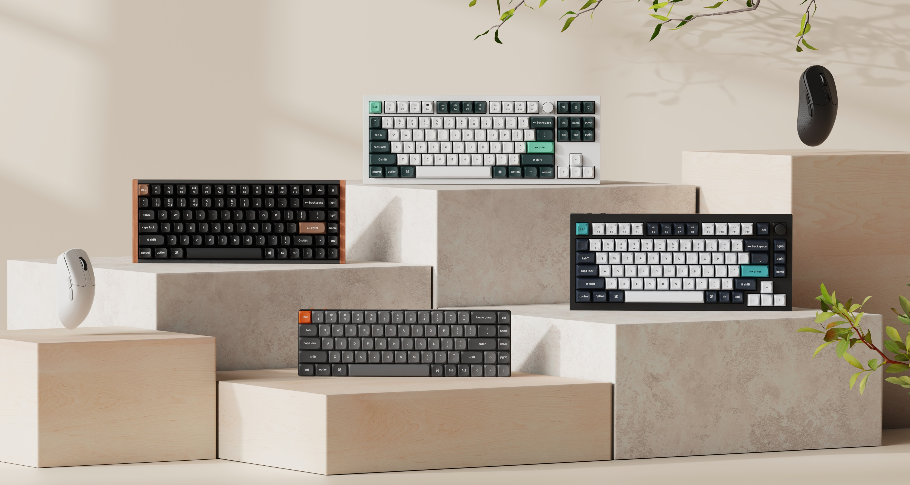
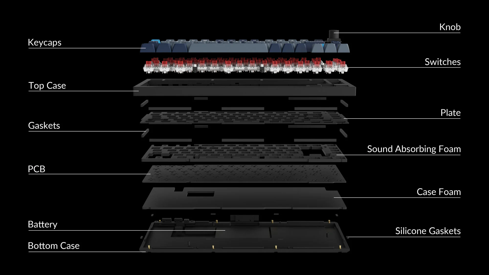

# Keychron Hardware Design

[](https://github.com/Keychron/Keychron-Keyboards-Hardware-Design)
[](https://github.com/Keychron/Keychron-Keyboards-Hardware-Design)
[](https://github.com/Keychron/Keychron-Keyboards-Hardware-Design/tree/main/docs)
[](https://github.com/Keychron/Keychron-Keyboards-Hardware-Design)

Production-grade hardware design files for Keychron keyboards and mice.

Study real CAD. Remix plates and cases. Design compatible accessories. Learn from how real products are built.

> This project is source-available. Personal and educational use is allowed. Original compatible accessories and add-ons are not subject to the commercial-use restriction in this license, but you may not copy and sell Keychron keyboards or mice, and you may not use Keychron trademarks as your own branding.



## Latest Updates

- **2026-09-03:** Added more Nape Pro files.
- **2026-09-02:** Added C1 files.
- **2026-08-26:** Added Q1 HE 8K files.
- **2026-08-13:** Added B2 Pro files.
- **2026-08-13:** Added B1 Pro files.
- **2026-08-13:** Added K2 Ultra 8K files.
- **2026-08-12:** Added J5 files.
- **2026-08-05:** Added more Q5 files.
- **2026-07-31:** Added BM22 files.
- **2026-07-30:** Added G5 files.
- **2026-07-29:** Added G3 and BM27 files.
- **2026-07-28:** Added G6 HE mouse files.
- **2026-07-27:** Added BM24 files.
- **2026-07-20:** Update links in Z11 Ultra 8K files.
- **2026-07-17:** Added more Q3 Ultra 8K and more Q6 Ultra 8K files.
- **2026-07-16:** Added K3 Ultra 8K files.
- **2026-07-10:** Added K3 HE files.
- **2026-07-09:** Added J2 files.
- **2026-06-24:** Update links in Q0 Plus files.
- **2026-06-17:** Added K9 Max files.
- **2026-06-16:** Added Z11 Ultra 8K files.
- **2026-06-05:** Added M4 Mod files by SlayCC.
- **2026-06-04:** Added V2 and more K6 HE files.
- **2026-06-02:** Added Q11 Ultra 8K files.
- **2026-05-26:** Added J7 files.
- **2026-05-19:** Added K3 files.
- **2026-05-18:** Added V3 Ultra 8K files.
- **2026-05-14:** Added K4 QMK files.
- **2026-05-08:** Added BM25 and more K3 Pro files.
- **2026-05-07:** Moved the download links for the files to the "Downloads section" of the "Readme file" within the corresponding product model folder. ** Added more K3 Pro files.
- **2026-04-29:** Added more K4 Pro and more K8 Pro files.
- **2026-04-28:** Added K6 HE, Q10 Max, Q60 Max, and Q65 Max files.
- **2026-04-27:** Added K8 files.
- **2026-04-24:** Added Q0 Max, Q5 Max, Q12 Max, Q13 Max, Q15 Max and K8 QMK files.
- **2026-04-22:** Added V3 and V3 8K files.
- **2026-04-21:** Added more K7 Pro files.
- **2026-04-17:** Added Q1 Max, Q8 Max and Q14 Max files.
- **2026-04-14:** Added more P6 Ultra 8K, K10 QMK and B6 Pro files.
- **2026-04-13:** Added P6 Ultra 8K, K2 QMK, K10 QMK files.
- **2026-04-12:** Added V1 8K, V3 8K, V5 8K, and V6 8K series folders and README pages.
- **2026-04-12:** Added V0 Ultra 8K, V1 Ultra 8K, V3 Ultra 8K, V5 Ultra 8K, V6 Ultra 8K, and V10 Ultra 8K series folders and README pages.
- **2026-04-12:** Added Q1 HE 8K, Q2 HE 8K, Q3 HE 8K, Q5 HE 8K, Q6 HE 8K, and Q16 HE 8K series folders and README pages.
- **2026-04-12:** Added Q1 Ultra 8K, Q3 Ultra 8K, Q5 Ultra 8K, and Q13 Ultra 8K series folders and README pages.
- **2026-04-11:** Added C3 Pro 8K, K4 HE, K8 HE, K2 QMK, Q0 HE, and Q12 HE.
- **2026-04-10:** Added more K0 Max files, Q12 HE and more Q6 Max files and more keycap profiles.
- **2026-04-09:** Added K10 HE, Q6 Max and K0 Max design files. Update: make the accessories not subject to licensing.
- **2026-04:** Added Q HE and mouse design files.
- **2026-03:** Expanded K Max coverage.
- More milestone updates will be published in [GitHub Releases](https://github.com/Keychron/Keychron-Keyboards-Hardware-Design/releases).

## Start Here

If you're new, begin with one of these paths:

- **Browse keyboard files**  
  Explore B Pro, C, C Pro 8K, J, Q, Q Pro, Q HE, Q Max, Q Ultra 8K, K Pro, K Max, K Ultra 8K, K HE, K QMK, V Max, and P HE models.

- **Browse mouse files**  
  Explore shell and full-model files for M, G, and BM series mice.

- **Open the files in CAD software**  
  Read the [File Format Guide](docs/file-format-guide.md) for STEP, DWG, DXF, and PDF compatibility.

- **Learn how to remix or modify a design**  
  Start with the [Getting Started Guide](docs/getting-started.md).

- **See the current filesystem inventory**  
  Open the [Repository Inventory](docs/repo-inventory.md) generated from the repo itself.

- **Contribute fixes or improvements**  
  Read [Contributing](docs/CONTRIBUTING.md) for workflow, file standards, and submission rules.

- **Join the community**  
  Join the [Keychron Discord](https://discord.com/invite/HAYbRrTsjN) to share builds, ask questions, and help grow the hardware modding community.

- **Understand the license before building**  
  Read the [License FAQ](docs/license-faq.md).

## What You Can Do With This Repository

- Study real industrial design and hardware packaging files
- Create case, plate, and accessory remixes
- Inspect dimensions, structure, and component integration
- Build community mods and compatible add-ons
- Contribute documentation, corrections, and new variants that fit the license

## What's Inside

| Series | Type | Models | Components |
|---|---|---|---|
| **B Pro Series** | Keyboard | B1 Pro, B2 Pro, B6 Pro | Case, PCB, Full Model |
| **C Series** | Keyboard | C1 | Plate, PCB, Top Case, Bottom Case, Full Model |
| **C Pro 8K Series** | Keyboard | C1 Pro 8K, C2 Pro 8K, C3 Pro 8K | Case, Plate, Full Model, Stabilizer |
| **J Series** | Keyboard | J2, J5, J7 | Plate, PCB, Bottom Case, Full Model |
| **Q Series** | Keyboard | Q0 Plus, Q1–Q12, Q60, Q65 | Case, Plate, Encoder, Full Model, Stabilizer, OSA Keycap |
| **Q Pro Series** | Keyboard | Q1 Pro–Q14 Pro (10 models) | Case, Plate, Encoder, Full Model, Stabilizer, KSA Keycap |
| **Q HE Series** | Hall Effect | Q0 HE, Q1 HE, Q2 HE, Q3 HE, Q4 HE, Q5 HE, Q6 HE, Q12 HE | Published files for selected models; newer Q HE folders also include README/model pages for future CAD uploads |
| **Q HE 8K Series** | Hall Effect | Q1 HE 8K, Q2 HE 8K, Q3 HE 8K, Q5 HE 8K, Q6 HE 8K, Q16 HE 8K | Published files for Q1 HE 8K; README/model pages prepared for the remaining Q HE 8K models |
| **Q Max Series** | Keyboard | Q0 Max, Q1 Max, Q2 Max, Q3 Max, Q5 Max, Q6 Max, Q8 Max, Q10 Max, Q12 Max, Q13 Max, Q14 Max, Q15 Max | Published CAD files for Q6 Max; README/model pages prepared for the others |
| **Q Ultra 8K Series** | Keyboard | Q1 Ultra 8K, Q3 Ultra 8K, Q5 Ultra 8K, Q6 Ultra 8K, Q11 Ultra 8K, Q13 Ultra 8K | Published files for Q3, Q6, and Q11 Ultra 8K; README/model pages prepared for the others |
| **K Pro Series** | Keyboard | K1 Pro–K17 Pro (16 models) | Case, Plate, Full Model, Stabilizer |
| **K Max Series** | Keyboard | K0 Max, K1 Max, K2 Max, K3 Max, K4 Max, K5 Max, K7 Max, K8 Max, K9 Max, K10 Max, K11 Max, K13 Max, K15 Max, K17 Max | Case, Plate, Full Model, Stabilizer, Keycap on selected models; README/model pages prepared for K4 Max and K9 Max |
| **K Ultra 8K Series** | Keyboard | K2 Ultra 8K, K3 Ultra 8K | Plate, PCB, Bottom Case, Full Model, Metal Strip |
| **K HE Series** | Hall Effect | K2 HE, K4 HE, K6 HE, K8 HE, K10 HE | Published models include case, plate, full model, stabilizer, and selected keycap files; K6 HE is currently folder-only |
| **K QMK Series** | Keyboard | K1 QMK, K2 QMK, K3 QMK, K4 QMK, K5 QMK, K8 QMK, K10 QMK | Published CAD files for K2 QMK; README/model pages prepared for the others |
| **L Series** | Keyboard | L1, L3 | Case, Plate, Knob, Full Model, Stabilizer |
| **V 8K Series** | Keyboard | V1 8K, V3 8K, V5 8K, V6 8K | README/model pages prepared for future CAD uploads |
| **V Ultra 8K Series** | Keyboard | V0 Ultra 8K, V1 Ultra 8K, V3 Ultra 8K, V5 Ultra 8K, V6 Ultra 8K, V10 Ultra 8K | README/model pages prepared for future CAD uploads |
| **V Max Series** | Keyboard | V1 Max–V10 Max | Case, Plate, Encoder, Full Model, Stabilizer, OSA Keycap |
| **P HE Series** | Hall Effect | P1 HE, P2 HE, P3 HE | Published files for P1 HE; README/model pages prepared for P2 HE and P3 HE |
| **Mouse Series** | Mouse | M1–M7, M2 Mini, M3 Mini, G1, G2, G3, G4, G5, G6 HE, BM22, BM24, BM25, BM27, Nape Pro (20 models) | Shell, Full Model, PTFE Files, Receiver Parts |

**163 device models. 768+ design files. Source-available. Accessory-friendly.**


## Directory Structure

```
B-Pro-Series/
  B1 Pro/               — Ultra-slim 75% wireless keyboard files with UK case, PCB, full model, and product page reference
  B2 Pro/               — Ultra-slim 96% wireless keyboard files with US case, PCB, full model, and product page reference
  B6 Pro/               — Ultra-slim full-size wireless keyboard files with case, full model, and product page reference
C-Series/
  C1/                   — Wired TKL keyboard files with plate, PCB, top case, bottom case, full model, and product page reference
C-Pro-8K-Series/
  C3 Pro 8K/            — Wired C Pro 8K hardware files, with C1 Pro 8K and C2 Pro 8K also present
J-Series/
  J5/                   — Full-size QMK wireless keyboard files with plate, PCB, bottom case, full model, and product page reference
Q-Series/
  Q0 Plus/              — Numpad files alongside Q1–Q12, Q60, and Q65
Q-HE-Series/
  Q0 HE/                — Hall Effect numpad files alongside Q1, Q2, Q3, Q4, Q5, Q6, and Q12 HE models
Q-HE-8K-Series/
  Q1 HE 8K/             — 75% wired Hall Effect 8K files with plate, PCB, top case, bottom case, full model, and product page reference
Q-Pro-Series/
  Q1 Pro/               — Wireless Q-series hardware files across 10 models
Q-Max-Series/
  Q0 Max/               — README and product page reference, with Q1, Q2, Q3, Q5, Q6, Q8, Q10, Q12, Q13, Q14, and Q15 Max model folders also present
Q-Ultra-8K-Series/
  Q3 Ultra 8K/          — Full-metal TKL wireless keyboard files with case, plate, PCB, full model, and product page reference
K-Pro-Series/
  K1 Pro/               — Low-profile and standard K Pro models through K17 Pro
  K8 Pro/               — Example model folder with `K8-Pro-Keycap.stp`
K-Max-Series/
  K0 Max/               — Numpad files alongside K1, K2, K3, K4, K5, K7, K8, K9, K10, K11, K13, K15, and K17 Max keyboard model folders
K-Ultra-8K-Series/
  K2 Ultra 8K/          — 75% wireless keyboard files with plate, PCB, bottom case, full model, metal strip, and product page reference
  K3 Ultra 8K/          — Ultra-slim 75% wireless keyboard files with plate, PCB, bottom case, full model, and product page reference
K-HE-Series/
  K2 HE/                — Example model folder with Cherry and OSA keycap STEP files
K-QMK-Series/
  K1 QMK/               — README and product page reference, with K2, K3, K4, K5, K8, and K10 QMK model folders also present
V-Max-Series/
  V1 Max/               — Tri-mode keyboard hardware files across V1–V10 Max
V-Ultra-8K-Series/
  V0 Ultra 8K/          — README and product page reference, ready for future CAD uploads alongside V1, V3, V5, V6, and V10 Ultra 8K
V-8K-Series/
  V1 8K/                — README and product page reference, ready for future CAD uploads alongside V3, V5, and V6 8K
P-HE-Series/
  P1 HE/                — Lemokey Hall Effect keyboard files, with P2 HE and P3 HE model pages also present
L-Series/
  L1/                   — Aluminum keyboard files with plate, case, knob, and stabilizers
Mice/
  BM22/                 — Lightweight wireless mouse files with product page reference
  G3/                   — Ultra-light wireless gaming mouse files with product page reference
  G5/                   — Ultra-light wireless gaming mouse files with product page reference
  BM27/                 — Vertical ergonomic wireless mouse files with product page reference
  M1/                   — Shell and full model
Keycap Profiles/
  Cherry Profile/       — Reference profile docs alongside KSA, LSA, MDA, OEM, and OSA
docs/
  file-format-guide.md  — How to open and edit these files
  getting-started.md    — First-stop guide for browsing and remixing
  3d-printing-guide.md  — Practical printing guidance for compatible parts
  CONTRIBUTING.md       — Contribution workflow and file standards
  CODE_OF_CONDUCT.md    — Community participation guidelines
  scripts/
    repo_inventory.py   — Regenerates the repository inventory from the live tree
```

## Why This Matters

Making production hardware files available is a meaningful contribution to the broader hardware and keyboard community.

- It lowers the barrier to entry by giving hobbyists, students, and engineers real STEP and DXF files they can study, remix, and build from instead of starting from zero.
- It expands what customization can mean. With access to case, plate, and component designs, the community can explore deeper hardware changes, new materials, structural tweaks, and original variations.
- It offers real educational value. These are production-level designs, so people can learn from actual decisions around mounting systems, tolerances, and component integration.
- It helps the ecosystem grow by enabling compatible accessories, modifications, and personal projects that build around existing designs.
- It also reflects trust and transparency. Sharing internal design files signals confidence in the products and supports users as creators, not just customers.

The license is designed to support the ecosystem around Keychron products while still protecting Keychron's core hardware business. In practice, original compatible accessories and add-ons are not subject to the commercial-use restriction in this license, but copying and selling Keychron keyboards or mice, or trading on Keychron trademarks, is not allowed.

## Contributing

**Ways to contribute:**
- Fix dimensional errors or tolerances in existing models
- Add ISO layout plate variants
- Improve documentation and guides
- Report issues with downloaded files

**Note:** This project is source-available. Original compatible accessories and add-ons are not subject to the commercial-use restriction in this license. By contributing, you agree your work falls under the same license.

## License

This project is **source-available**. The files may be used for personal and educational work. Original compatible accessories and add-ons are not subject to the commercial-use restriction in this license.

**You may not use these files to copy, manufacture, sell, or distribute Keychron keyboards or mice, or substantially similar products, and you may not use Keychron trademarks as your own branding.**

See the [LICENSE](LICENSE) file for full terms.

## Links

- [Keychron Website](https://www.keychron.com)
- [Keychron Discord Community](https://discord.com/invite/HAYbRrTsjN)
- [Keychron Firmware (QMK, main branch)](https://github.com/Keychron/qmk_firmware/tree/master/keyboards/keychron)
- [Keychron Firmware (Bluetooth boards)](https://github.com/Keychron/qmk_firmware/tree/bluetooth_playground/keyboards/keychron)
- [Keychron Firmware (2.4 GHz wireless boards)](https://github.com/Keychron/qmk_firmware/tree/wireless_playground/keyboards/keychron)
- [Keychron Firmware (Hall Effect boards)](https://github.com/Keychron/qmk_firmware/tree/hall_effect_playground/keyboards/keychron)
- [Keychron Firmware (ZMK)](https://github.com/Keychron/zmk)
- [Open source gaming mouse firmware (ZGM）](https://zgm.gg/)

---

*Built by [Keychron](https://www.keychron.com) — source-available hardware design files for the community.*


## 🌐 Web Resources & Interactive Index
- [SQUID ESCAPE GAME](https://eduquests.onrender.com/squid-escape-game.html)
- [CATEGORY STICKMAN175](https://brainquestses.pages.dev/category-stickman175.html)
- [COLORWARSIO CONQUEST GAME](https://eduquestses.pages.dev/colorwarsio-conquest-game.html)
- [SWEETSU TILE PUZZLE](https://eduquestses.pages.dev/sweetsu-tile-puzzle.html)
- [POP STAR](https://eduquestses.pages.dev/pop-star.html)
- [MAHJONG LINES](https://eduquestses.pages.dev/mahjong-lines.html)
- [WORD SEARCH UNIVERSE 2](https://eduquestses.pages.dev/word-search-universe-2.html)
- [NINJA SURVIVOR](https://eduquestkr.pages.dev/ninja-survivor.html)
- [CATEGORY PREMIUM PERKS71](https://eduquestkr.pages.dev/category-premium-perks71.html)
- [HAPPY BROTHERS](https://eduquestses.pages.dev/happy-brothers.html)
- [JOURNEY OF ESCAPE](https://eduquestkr.pages.dev/journey-of-escape.html)
- [SPRUNKI PUZZLES AND SINGING](https://eduquestkr.pages.dev/sprunki-puzzles-and-singing.html)
- [BUBBLY LAB](https://eduquestses.pages.dev/bubbly-lab.html)
- [MONEY FACTORY EARN A BILLION](https://eduquestses.pages.dev/money-factory-earn-a-billion.html)
- [TAP GALLERY](https://eduquestses.pages.dev/tap-gallery.html)
- [WORM APPLE QUEST](https://eduquestses.pages.dev/worm-apple-quest.html)
- [SPIN THRU](https://eduquestses.pages.dev/spin-thru.html)
- [SANDSTORM COVERT OPS](https://eduquestkr.pages.dev/sandstorm-covert-ops.html)
- [DYNAMONS 8](https://brainquests.pages.dev/dynamons-8.html)
- [TOCA TEENS FLOATING BEACH PARTY](https://learnaction.github.io/toca-teens-floating-beach-party.html)
- [DRAW TO SMASH](https://eduquestses.pages.dev/draw-to-smash.html)
- [CELEBRITY AESTHETIC CHALLENGE](https://welearnaction.onrender.com/celebrity-aesthetic-challenge.html)
- [ULTIMATE BRAINROT CLICKER](https://welearnaction.onrender.com/ultimate-brainrot-clicker.html)
- [LULUS FASHION WORLD](https://eduquestkr.pages.dev/lulus-fashion-world.html)
- [GRAFFITI TAGS SPRAY PAINTING](https://learnaction.github.io/graffiti-tags-spray-painting.html)
- [HIDDEN OBJECTS BAKERY](https://eduquestkr.pages.dev/hidden-objects-bakery.html)
- [LIFE CLICKER](https://learnaction.github.io/life-clicker.html)
- [KICK LOSER](https://learnaction.github.io/kick-loser.html)
- [HEXA SORT](https://eduquestkr.pages.dev/hexa-sort.html)
- [INSTA TRENDS GALAXY FASHION](https://eduquestses.pages.dev/insta-trends-galaxy-fashion.html)
- [UP HERO](https://welearnaction.onrender.com/up-hero.html)
- [VOLLEY BEANS VOLLEYBALL GAME](https://learnaction.github.io/volley-beans-volleyball-game.html)
- [INDEX6](https://eduquests.netlify.app/index6.html)
- [CUT THE ROPE 2](https://eduquestses.pages.dev/cut-the-rope-2.html)
- [NUMBER COLLECTOR BRAINTEASER](https://eduquestkr.pages.dev/number-collector-brainteaser.html)
- [INDEX7](https://eduquests.netlify.app/index7.html)
- [SCHOOL TEACHER GAME SCHOOL DAY](https://eduquestses.pages.dev/school-teacher-game-school-day.html)
- [CUBE COMBO](https://eduquestkr.pages.dev/cube-combo.html)
- [WORMSARENAIO](https://eduquestkr.pages.dev/wormsarenaio.html)
- [COLOR RINGS BLOCK PUZZLE](https://eduquests.netlify.app/color-rings-block-puzzle.html)
- [CATEGORY WATER39](https://eduquests.netlify.app/category-water39.html)
- [MATH MASTER](https://eduquests.netlify.app/math-master.html)
- [ANIMAL RACING IDLE PARK](https://eduquests.netlify.app/animal-racing-idle-park.html)
- [COLOR WAVEE](https://learnaction.github.io/color-wavee.html)
- [CAT EVOLUTION 2](https://eduquests.netlify.app/cat-evolution-2.html)
- [SPRUNKI FIND THE DIFFERENCES](https://eduquests.netlify.app/sprunki-find-the-differences.html)
- [CONSTRUCTION SIMULATOR](https://eduquests.netlify.app/construction-simulator.html)
- [SITEMAP](https://cryptotify.web.app/sitemap.html)
- [WORD CROSS](https://eduquestses.pages.dev/word-cross.html)
- [CUTE CRAFT LAB](https://eduquestses.pages.dev/cute-craft-lab.html)
- [KICK AND RIDE](https://eduquestses.pages.dev/kick-and-ride.html)
- [ITALIAN BRAINROT PUZZLE BATTLE](https://eduquestkr.pages.dev/italian-brainrot-puzzle-battle.html)
- [BLOCK STACKING](https://eduquestkr.pages.dev/block-stacking.html)
- [WORD ART COLOR BOOK PUZZLE](https://eduquestses.pages.dev/word-art-color-book-puzzle.html)
- [CATEGORY BRAIN261](https://brainquests.pages.dev/category-brain261.html)
- [SWORDSMAN ADVENTURE](https://eduquests.netlify.app/swordsman-adventure.html)
- [LABUBU MERGE CLICKER](https://eduquests.netlify.app/labubu-merge-clicker.html)
- [EVERMATCH](https://eduquests.github.io/evermatch.html)
- [ITALIAN BRAINROT BIKE RUSH](https://brainquests.pages.dev/italian-brainrot-bike-rush.html)
- [ZINDEX](https://eduquestkr.pages.dev/zindex.html)
- [BRILLIANT JEWELS](https://eduquestkr.pages.dev/brilliant-jewels.html)
- [CATEGORY POINT AND CLICK123](https://brainquests.pages.dev/category-point-and-click123.html)
- [CATEGORY MISSION207](https://eduquests.netlify.app/category-mission207.html)
- [WORLD Z DEFENSE ZOMBIE DEFENSE](https://eduquestses.pages.dev/world-z-defense-zombie-defense.html)
- [AHA WORLD DREAM TOWN](https://eduquestsfr.pages.dev/aha-world-dream-town.html)
- [HIDE AND ESCAPE FROM ANGRY TEACHER](https://eduquestses.pages.dev/hide-and-escape-from-angry-teacher.html)
- [SHAPE TRANSFORM RACE](https://eduquestsfr.pages.dev/shape-transform-race.html)
- [CATEGORY PLATFORM260](https://brainquests.pages.dev/category-platform260.html)
- [PRINXY WINTERELLA](https://eduquestses.pages.dev/prinxy-winterella.html)
- [CATEGORY SOCCER 2](https://eduquestsfr.pages.dev/category-soccer-2.html)
- [MATH CROSSWORD PUZZLE GENIUS EDITION](https://eduquestses.pages.dev/math-crossword-puzzle-genius-edition.html)
- [BURGER CAFE COOKING GAMES FOR KIDS](https://eduquestses.pages.dev/burger-cafe-cooking-games-for-kids.html)
- [CATEGORY ANIMAL](https://brainquests.pages.dev/category-animal.html)
- [CAPYBARA SUIKA](https://eduquestses.pages.dev/capybara-suika.html)
- [SPACE CRAFT SHIP WAR](https://learnaction.github.io/space-craft-ship-war.html)
- [CATEGORY ARENA255](https://eduquestsfr.pages.dev/category-arena255.html)
- [BUS COLOR JAM](https://eduquestses.pages.dev/bus-color-jam.html)
- [MAHJONG TILE CLUB](https://welearnaction.onrender.com/mahjong-tile-club.html)
- [SID GINNY Y2K GLAM CLASH](https://learnaction.netlify.app/sid-ginny-y2k-glam-clash.html)
- [12 IN 1 SOLITAIRE](https://eduquestkr.pages.dev/12-in-1-solitaire.html)
- [CRYPTOGRAM](https://learnaction.netlify.app/cryptogram.html)
- [CATEGORY IDLE445](https://eduquestsfr.pages.dev/category-idle445.html)
- [ZOMBIE CONQUER COUNTRIES](https://learnaction.github.io/zombie-conquer-countries.html)
- [ONE HERO](https://eduquests.github.io/one-hero.html)
- [CATEGORY 3D1 383](https://brainquests.pages.dev/category-3d1-383.html)
- [HEXAGON](https://eduquests.github.io/hexagon.html)
- [CATEGORY BRAIN260](https://eduquestsfr.pages.dev/category-brain260.html)
- [KNIT RESCUE](https://learnaction.netlify.app/knit-rescue.html)
- [TERMS](https://cryptotify.github.io/terms.html)
- [CATEGORY IO](https://eduquestsfr.pages.dev/category-io.html)
- [BALL JUMP SWITCH THE COLORS](https://eduquestses.pages.dev/ball-jump-switch-the-colors.html)
- [HOUSE DEEP CLEAN SIM](https://eduquestkr.pages.dev/house-deep-clean-sim.html)
- [BEAUTY WORLD AND FASHION STYLIST](https://eduquestkr.pages.dev/beauty-world-and-fashion-stylist.html)
- [GUNS VS MAGIC](https://eduquests.netlify.app/guns-vs-magic.html)
- [BATTLE SIMULATOR SANDBOX](https://eduquestses.pages.dev/battle-simulator-sandbox.html)
- [CATEGORY ADVENTURE](https://eduquestsfr.pages.dev/category-adventure.html)
- [CATEGORY BASKETBALL](https://brainquests.pages.dev/category-basketball.html)
- [HOT COLD WINTER STYLE](https://eduquestsfr.pages.dev/hot-cold-winter-style.html)
- [DOOMSDAY TOWER DEFENSE](https://eduquestses.pages.dev/doomsday-tower-defense.html)
- [CATEGORY DRAWING GAMES](https://brainquests.pages.dev/category-drawing-games.html)
- [KNOTS](https://eduquestses.pages.dev/knots.html)
- [FOOD TRUCK CHEF](https://learnaction.github.io/food-truck-chef.html)
- [BFF EASTER PHOTOBOOTH PARTY](https://eduquestkr.pages.dev/bff-easter-photobooth-party.html)
- [IMAGE CROSSWORD](https://learnaction.netlify.app/image-crossword.html)
- [FLIGHT PILOT AIRPLANE GAMES 24](https://eduquestses.pages.dev/flight-pilot-airplane-games-24.html)
- [CATEGORY MERGE 2](https://brainquests.pages.dev/category-merge-2.html)
- [MONSTER SQUAD RUSH](https://eduquestsfr.pages.dev/monster-squad-rush.html)
- [CATEGORY ESCAPE 2](https://eduquests.netlify.app/category-escape-2.html)
- [CELEBRITIES GET READY FOR CHRISTMAS](https://eduquestkr.pages.dev/celebrities-get-ready-for-christmas.html)
- [SOCCER ARENA X](https://eduquestses.pages.dev/soccer-arena-x.html)
- [CATEGORY BIKE63](https://eduquestsfr.pages.dev/category-bike63.html)
- [JUMP BALL CLASSIC](https://eduquestses.pages.dev/jump-ball-classic.html)
- [INDEX32](https://eduquestsfr.pages.dev/index32.html)
- [CATEGORY BUILDING](https://eduquests.netlify.app/category-building.html)
- [DADDY RABBIT](https://eduquests.netlify.app/daddy-rabbit.html)
- [CATEGORY DYKNOW](https://eduquests.github.io/category-dyknow.html)
- [BLOCK BLAST 2048](https://eduquestses.pages.dev/block-blast-2048.html)
- [OBBY ON A BIKE](https://eduquestses.pages.dev/obby-on-a-bike.html)
- [PRINCESS WINTER ICE SKATING OUTFITS](https://eduquestkr.pages.dev/princess-winter-ice-skating-outfits.html)
- [CATEGORY DEFENSE176](https://brainquests.pages.dev/category-defense176.html)
- [ZEN MASTER 3 TILES](https://eduquestkr.pages.dev/zen-master-3-tiles.html)
- [CATEGORY CAR](https://learnaction.github.io/category-car.html)
- [ASOKA MAKEUP INDIAN BRIDE](https://brainquests.pages.dev/asoka-makeup-indian-bride.html)
- [HIDDEN OBJECT FARM ADVENTURE](https://eduquestses.pages.dev/hidden-object-farm-adventure.html)
- [KATANA](https://learnaction.netlify.app/katana.html)
- [UFO ATTACK](https://eduquestkr.pages.dev/ufo-attack.html)
- [SNIPER FREEZE](https://eduquests.github.io/sniper-freeze.html)
- [CATEGORY TOWER DEFENSE](https://learnaction.netlify.app/category-tower-defense.html)
- [REAL DRIVING SIMULATOR](https://learnaction.github.io/real-driving-simulator.html)
- [CARS VS ZOMBIES](https://learnaction.github.io/cars-vs-zombies.html)
